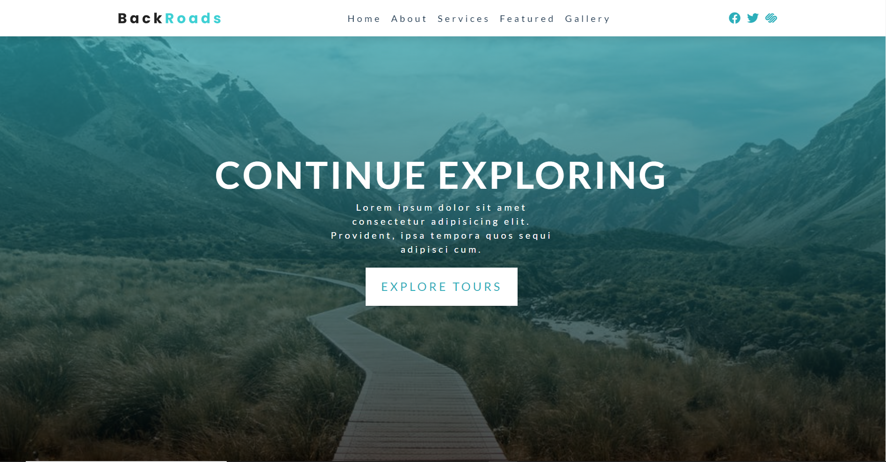

# Back Roads Company

## _Practice project with Flexbox_

Back Roads Company is a website purposely created for study reasons. Whit the use of HTML5, CSS3, and a bit of JavaScript, this responsive website is:

- smooth scrolling,
- mobile-friendly,
- with locally hosted icons,
- ready to receive some emails (integrated Formspree).

## Reviewing you can exercise:

- HTML5 tangs and CSS3 selectors,
- creating a responsive website using Flexbox,
- two types of navbars (hide for smaller screens)
- linking external: styles, scripts, fonts, favicons,…
- local hosting icons from Font Awesome,
- connect Formspree for receiving emails.

## Built from source:

[HTML&CSS Tutorial and Projects Course 2022 (Flexbox&Grid)](https://www.udemy.com/course/in-depth-html-css-course-build-responsive-websites/)
